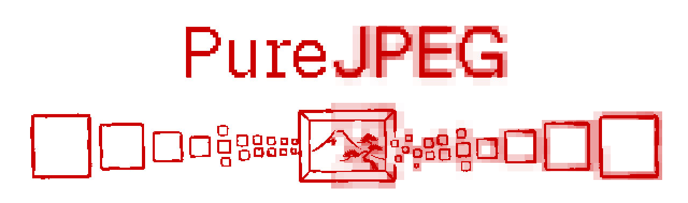
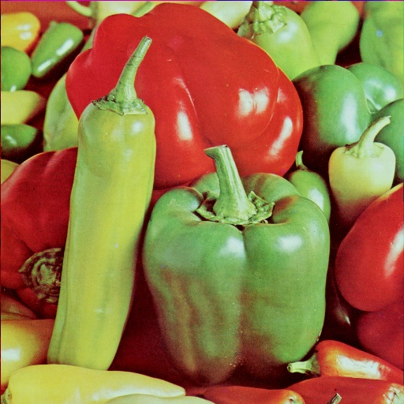
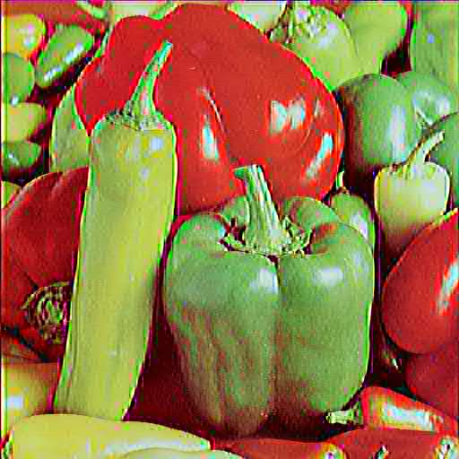
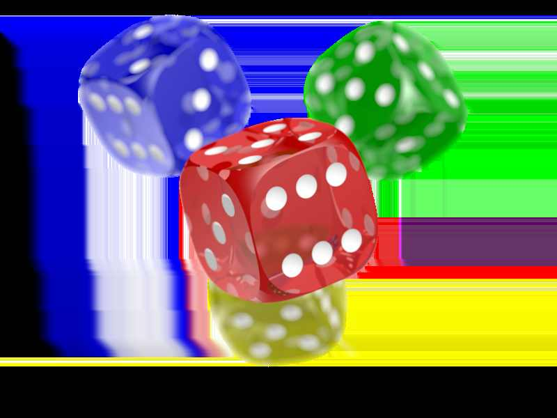

<p align="center">
  
</p>

# PureJPEG - Pure Ruby JPEG encoder and decoder library

Convert PNG or other pixel data to JPEG. Or the other way! Implements baseline JPEG (DCT, Huffman, 4:2:0 chroma subsampling) and exposes a variety of encoding options to adjust parts of the JPEG pipeline not normally available (I needed this to recreate the JPEG compression styles of older digital cameras - don't ask..)

It works on CRuby 3.0+, TruffleRuby 33.0, and JRuby 10.0.

> [!NOTE]
> Rubyists might find the [AI Disclosure](#ai-disclosure) section below of interest.

## Installation

You know the drill: 

```ruby
gem "pure_jpeg"
```

```
gem install pure_jpeg
```

There are no runtime dependencies. [ChunkyPNG](https://github.com/wvanbergen/chunky_png) is optional (though quite useful) if you want to use `from_chunky_png`. I have a pure PNG encoder/decoder not far behind this that will ultimately plug in nicely too to get 100% pure Ruby graphical bliss ;-)

`examples/` contains some useful example scripts for basic JPEG to PNG and PNG to JPEG conversion if you want to do some quick tests without writing code.

## Encoding (making JPEGs!)

### From ChunkyPNG (easiest to get started)

```ruby
require "chunky_png"
require "pure_jpeg"

image = ChunkyPNG::Image.from_file("photo.png")
PureJPEG.from_chunky_png(image, quality: 80).write("photo.jpg")
```

### From any pixel source

PureJPEG accepts any object that responds to `width`, `height`, and `[x, y]` (returning an object with `.r`, `.g`, `.b` in 0-255):

```ruby
require "pure_jpeg"

encoder = PureJPEG.encode(source, quality: 85)
encoder.write("output.jpg")

# Or get raw bytes
jpeg_data = encoder.to_bytes
```

### From raw pixel data

```ruby
source = PureJPEG::Source::RawSource.new(width, height) do |x, y|
  [r, g, b]  # return RGB values 0-255
end

PureJPEG.encode(source).write("output.jpg")
```

### Grayscale

```ruby
PureJPEG.encode(source, grayscale: true).write("gray.jpg")
```

### Encoder options

```ruby
PureJPEG.encode(source,
  quality: 85,                    # 1-100, overall compression level
  grayscale: false,               # single-channel grayscale mode
  chroma_quality: nil,            # 1-100, independent Cb/Cr quality (defaults to quality)
  luminance_table: nil,           # custom 64-element quantization table for Y
  chrominance_table: nil,         # custom 64-element quantization table for Cb/Cr
  quantization_modifier: nil,     # proc(table, :luminance/:chrominance) -> modified table
  scramble_quantization: false    # intentionally misordered quant tables (creative effect)
)
```

See [CREATIVE.md](CREATIVE.md) for detailed examples of the creative encoding options.

Here's a quick example of sort of the "old digital camera" effect I was looking for though:

<table>
<tr>
<td align="center"><strong>Normal</strong></td>
<td align="center"><strong>Scrambled quantization</strong></td>
</tr>
<tr>
<td></td>
<td></td>
</tr>
</table>

And here's what happens when you convert a PNG with transparency — JPEG doesn't support alpha, so the hidden RGB data behind transparent pixels bleeds through:

<table>
<tr>
<td align="center"><strong>PNG with transparency</strong></td>
<td align="center"><strong>Converted to JPEG</strong></td>
</tr>
<tr>
<td></td>
<td></td>
</tr>
</table>

I consider this a feature but you may consider it a deficiency and that a default background of white should be applied. This may be something I'll add if anyone wants it!

Note that each stage of the JPEG pipeline is a separate module, so individual components (DCT, quantization, Huffman coding) can be replaced or extended independently which is kinda my plan here as I made this to play around with effects.

## Decoding (reading JPEGs!)

### From file

```ruby
image = PureJPEG.read("photo.jpg")
image.width   # => 1024
image.height  # => 768
pixel = image[100, 200]
pixel.r  # => 182
pixel.g  # => 140
pixel.b  # => 97
```

### From binary data

```ruby
image = PureJPEG.read(jpeg_bytes)
```

### Iterating pixels

```ruby
image.each_pixel do |x, y, pixel|
  puts "#{x},#{y}: rgb(#{pixel.r}, #{pixel.g}, #{pixel.b})"
end
```

### Re-encoding

A decoded `PureJPEG::Image` implements the same pixel source interface, so it can be passed directly back to the encoder:

```ruby
image = PureJPEG.read("input.jpg")
PureJPEG.encode(image, quality: 60).write("recompressed.jpg")
```

### Converting to PNG (with ChunkyPNG)

```ruby
image = PureJPEG.read("photo.jpg")

png = ChunkyPNG::Image.new(image.width, image.height)
image.each_pixel do |x, y, pixel|
  png[x, y] = ChunkyPNG::Color.rgb(pixel.r, pixel.g, pixel.b)
end
png.save("photo.png")
```

## Format support

Encoding:
- Baseline DCT (SOF0)
- 8-bit precision
- Grayscale (1 component) and YCbCr color (3 components)
- 4:2:0 chroma subsampling (color) or no subsampling (grayscale)
- Standard Huffman tables (Annex K)

Decoding:
- Baseline DCT (SOF0) and Progressive DCT (SOF2)
- 8-bit precision
- 1-component (grayscale) and 3-component (YCbCr) images
- Any chroma subsampling factor (4:4:4, 4:2:2, 4:2:0, etc.)
- Restart markers (DRI/RST)

Not supported: arithmetic coding, 12-bit precision, EXIF/ICC profile preservation, adding a default background for transparent sources (see what happens above!). Largely because I don't need these, but they are all do-able, especially with how loosely coupled this library is internally. Raise an issue if you really care about them!

## Performance

On a 1024x1024 image (Ruby 3.4 on my M1 Max):

| Operation | Time |
|-----------|------|
| Encode (color, q85) | ~1.9s |
| Decode (color) | ~2.0s |

Both the encoder and decoder use a separable DCT with a precomputed cosine matrix and reuse all per-block buffers to minimize GC pressure. Pixel data is stored as packed integers internally to avoid per-pixel object allocation.

## Some useful `rake` tasks

```
bundle install
rake test        # run the test suite
rake benchmark   # benchmark encoding (3 runs against examples/a.png)
rake profile     # CPU profile with StackProf (requires the stackprof gem)
```

## AI Disclosure

**Claude Code did the majority of the work.** The math of JPEG encoding/decoding is beyond me, except 'getting it' at a high level. I understand it like I understand the engine in my car :-)

**I have read all of the code produced.** The algorithms are above my paygrade, but I'm OK with what has been produced, and I manually fixed a variety of stylistic things along the way. For example, CC seems to like wrapping entire functions in `if` statements rather than bailing on the opposite condition.

**CC needed a lot of guidance.** Its initial JPEG algorithm was somewhat naive and output odd looking JPEGs akin to those of my Kodak digital camera from 2001. After some back and forth and image comparisons, we figured out it was doing the quantization entirely wrong (specifically not using the zigzag approach during quanitization but just going in raster order). I *like* this aesthetic, but fixed it up so that it works as a generally usable JPEG library, while adding ways to customize things so you can recreate the effect, if preferred (see `CREATIVE.md` for more on that).

**CC is lazy.** The initial implementation was VERY SLOW. It took 15 seconds to turn a 1024x1024 PNG into a JPEG, so we went down the profiling rabbit hole and found many optimizations to make it ~6x faster. CC is poor at considering the role of Ruby's GC when implementing low level algorithms and needs some prodding to make the correct optimizations. CC is also lazy to the point of recommending that you just use another language (e.g. Go or Rust) rather than do a pure Ruby version of something - despite it being possible with some extra work.

**CC's testing and cleanliness leaves a bit to be desired.** The CC-created tests were superficial, so I worked on getting them beefed up to tackle a variety of edge cases. They could still get better. It also didn't do RDoc comments, use Minitest, and a variety of other things I coerced it into working on. A good `CLAUDE.md` file could probably avoid many of these problems. I worked without one.

**The overall experience was good.** I enjoyed this project, but CC clearly requires an experienced developer to keep it on the rails and to not end up with a bunch of buggy half-working crap. Getting to the basic 'turn a PNG into a JPEG' took only twenty minutes, but the rest of making it actually widely useful took several hours more.

## License

MIT
